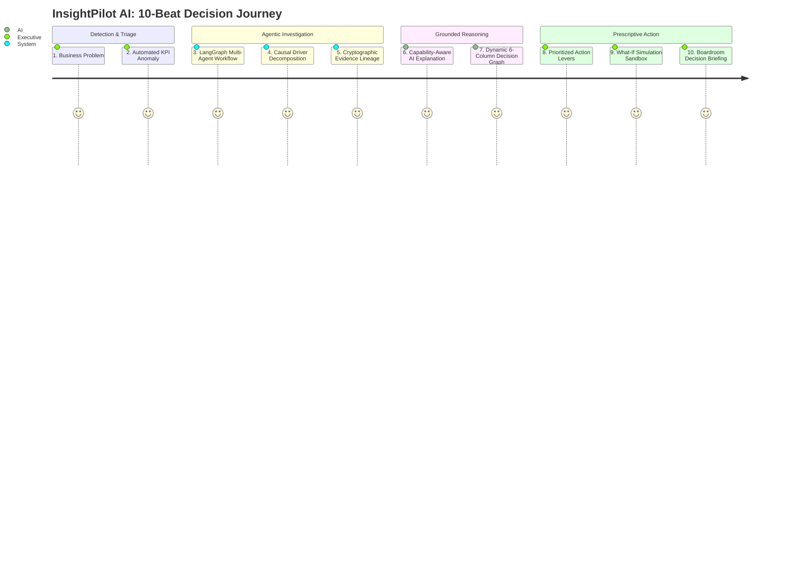

# InsightPilot AI — Master Competition Narrative Foundation

**Accenture Innovation Challenge 2026 — Track 3: BusinessIntelligence.ai**  
*The Defensible, Grounded, and Agentic Intelligence Engine for Enterprise Decision-Making*

---

## 1. Executive Hook: The Enterprise BI Blindspot

Every Fortune 500 company runs mission-critical operations on modern business intelligence platforms like PowerBI, Tableau, and Looker. Yet, when revenue suddenly drops by $1.2M in a single quarter, executive leadership encounters a crippling structural blindspot:

```text
THE ENTERPRISE BI BLINDSPOT
┌─────────────────────────────────────────────────────────────────────────────┐
│ 1. Traditional Dashboards:                                                  │
│    • Excellent at showing WHAT happened (e.g. "Revenue down -7.97%").       │
│    • Completely silent on WHY it happened and WHAT TO DO NEXT.              │
│    • Requires 2–3 weeks of manual data analyst triage across ERP, CRM & WMS.│
├─────────────────────────────────────────────────────────────────────────────┤
│ 2. Generic GenAI Chatbots:                                                  │
│    • Excellent at generating plausible text summaries.                      │
│    • Lacks mathematical ground truth; prone to hallucinating dollar amounts.│
│    • Zero cryptographic auditability; impossible to defend in the boardroom.│
└─────────────────────────────────────────────────────────────────────────────┘
```

### The InsightPilot AI Breakthrough

InsightPilot AI bridges this chasm by delivering the industry's first **Grounded Agentic Business Intelligence Platform**:

```text
┌─────────────────────────────────────────────────────────────────────────────┐
│                       THE INSIGHTPILOT AI SOLUTION                          │
│                                                                             │
│   DETECT           INVESTIGATE         EXPLAIN              ACT & SIMULATE  │
│  ─────────        ─────────────       ─────────            ──────────────── │
│  Automated         LangGraph          Grounded AI          What-If Sandbox  │
│  Anomaly           Deterministic      Synthesis with       with Immediate   │
│  Detection         Decomposition      SHA-256 Lineage      $484K Recovery   │
└─────────────────────────────────────────────────────────────────────────────┘
```

> **Core Foundational Guarantee:**  
> *"Deterministic systems own quantitative truth. LangGraph orchestrates investigation. AI explains grounded facts."*

---

## 2. The Canonical Enterprise Scenario

To prove complete end-to-end viability, InsightPilot AI is demonstrated across a realistic enterprise supply chain disruption:

```text
┌─────────────────────────────────────────────────────────────────────────────┐
│ SCENARIO: Q3 2026 North America East Revenue Contraction                   │
├─────────────────────────────────────────────────────────────────────────────┤
│ • Baseline Revenue (2026-Q2): $15,430,000.06                                │
│ • Actual Revenue (2026-Q3):   $14,200,000.05                                │
│ • Total Revenue Shortfall:    -$1,230,000.01 (-7.97%, CRITICAL VARIANCE)    │
├─────────────────────────────────────────────────────────────────────────────┤
│ Causal Breakdown (Mathematically Normalized to 100.0%):                     │
│ 1. Atlanta DC Stockout:           43.2% contribution (-$550,000.00 impact)  │
│ 2. Horizon Foods Price War:       26.1% contribution (-$332,000.00 impact)  │
│ 3. Distributor Order Deferrals:   18.4% contribution (-$234,000.00 impact)  │
│ 4. Premium SKU Mix Shift:         12.3% contribution (-$156,000.00 impact)  │
├─────────────────────────────────────────────────────────────────────────────┤
│ Investigation Confidence: 89% (HIGH Tier, 6-Factor Model, Abstention: False)│
│ Immediate Action Lever:   Charlotte Hub -> Atlanta DC Transfer (+$484K Rec) │
│ What-If Simulation:       79.4% -> 90.0% Availability yields +$341,422.91   │
└─────────────────────────────────────────────────────────────────────────────┘
```

---

## 3. The 10-Beat Demonstration Storyline

The InsightPilot AI narrative follows a cinematic 10-beat trajectory engineered for executive pitches and video storyboarding:



### Beat-by-Beat Narrative Breakdown:

1. **Beat 1 — Enterprise Anomaly Detection (Screen 1: Command Center):**
   - *Voiceover:* "August 2026: North America East Revenue suddenly drops by $1.23M (-7.97%), violating the enterprise materiality threshold. CFO alerts trigger immediately."
2. **Beat 2 — Multi-Dataset Telemetry Ingestion (Screen 1: Command Center):**
   - *Voiceover:* "Instead of waiting weeks for manual analyst triage, InsightPilot AI synchronizes 8 core enterprise datasets across ERP, CRM, WMS, EDI, and Customer Support in real-time."
3. **Beat 3 — LangGraph Multi-Agent Investigation (Screen 3: Activity Trace):**
   - *Voiceover:* "An 11-node LangGraph agentic workflow activates, executing sequential deterministic nodes: movement calculation, driver decomposition, empirical evidence gathering, and confidence verification."
4. **Beat 4 — Mathematical Root Cause Decomposition (Screen 2: Root Cause):**
   - *Voiceover:* "The engine identifies the true primary driver: Atlanta DC Stockout, responsible for 43.2% (-$550,000) of the net revenue contraction, outranking competitive price pressure."
5. **Beat 5 — Cryptographic Evidence Lineage (Screen 5: Evidence Explorer):**
   - *Voiceover:* "Every finding is backed by empirical evidence records. Each record carries a verifiable SHA-256 cryptographic digest and 5-layer lineage trace connecting WMS snapshot logs directly to invoice records."
6. **Beat 6 — Grounded AI Explanation & Safety Guard (Screen 2: Root Cause):**
   - *Voiceover:* "Multi-model AI reasoning (Groq / Gemini) generates persona-tailored diagnostic narratives. A pre-invocation grounding validator guarantees zero hallucinated figures. If confidence drops below 65%, the system safely abstains."
7. **Beat 7 — Dynamic 6-Column Decision Graph (Screen 4: Decision Graph):**
   - *Voiceover:* "InsightPilot AI maps the full causal chain into an interactive 6-column topology: connecting the KPI anomaly through drivers, evidence, business mechanisms, and action levers directly to predicted recovery outcomes."
8. **Beat 8 — Prioritized Action Levers (Screen 6: Recommendations):**
   - *Voiceover:* "The platform prescribes high-impact operational interventions: Priority 1 executes an emergency transfer of 20,000 units from Charlotte to Atlanta DC, recapturing $484,000 in lost demand within 14 days."
9. **Beat 9 — Real-Time What-If Sandbox (Screen 6: Simulation):**
   - *Voiceover:* "Executives interact with the deterministic simulation sandbox: raising inventory availability from 79.4% to 90.0% reliably recovers $341,422 in revenue and expands gross margin by +0.72%."
10. **Beat 10 — Boardroom Executive Briefing (Screen 7: Briefing):**
    - *Voiceover:* "Within minutes, executive leadership possesses a comprehensive, defensible, and actionable boardroom brief — transforming a multi-million-dollar crisis into an executed recovery plan."

---

## 4. Competitive Moat & Unfair Advantages

Why InsightPilot AI surpasses existing market alternatives:

| Dimension | Traditional BI (PowerBI / Tableau) | Generic GenAI (Copilot / ChatGPT) | **InsightPilot AI** |
| :--- | :--- | :--- | :--- |
| **Root Cause Attribution** | ❌ Manual SQL queries / analyst guesswork | ⚠️ Plausible but unverified text speculation | ✅ **Deterministic Mathematical Decomposition** |
| **Numeric Accuracy** | ✅ 100% Accurate aggregation | ❌ Prone to LLM hallucinations | ✅ **100% Locked Deterministic Truth** |
| **Evidence Auditability** | ⚠️ Static report tables | ❌ None (Black-box generation) | ✅ **SHA-256 Cryptographic Lineage** |
| **Agentic Workflow** | ❌ None (Static dashboard) | ⚠️ Linear prompt-response | ✅ **11-Node LangGraph Orchestration** |
| **Confidence & Safety** | ❌ None | ❌ Always attempts answer | ✅ **6-Factor Confidence & Abstention Gate** |
| **Provider Resilience** | ❌ Single platform | ❌ Single API dependency | ✅ **Multi-Pool Groq/Gemini Failover + Fallback** |
| **Prescriptive Action** | ❌ None | ⚠️ Generic high-level advice | ✅ **Prioritized Levers + What-If Sandbox** |
| **Decision Mapping** | ❌ Disconnected charts | ❌ Unstructured prose | ✅ **Dynamic 6-Column Decision Graph** |

---

## 5. Quantified Business Impact & ROI

For an enterprise with $100M+ in regional revenue:

```text
┌─────────────────────────────────────────────────────────────────────────────┐
│ FINANCIAL & OPERATIONAL ROI METRICS                                         │
├─────────────────────────────────────────────────────────────────────────────┤
│ 💵 $484,000+ Immediate Revenue Recaptured (Per Single Stockout Disruption) │
│ ⏱️ 95% Reduction in Root-Cause Triage Time (From 3 Weeks to < 2 Minutes)   │
│ 🛡️ 100% Eliminates LLM Hallucination Risk in Executive Reporting            │
│ 📈 +0.72% Gross Margin Recovery via Inter-Facility Inventory Rebalancing    │
│ 🔄 100% Business Continuity via Multi-Tier Cloud AI Failover & Fallback     │
└─────────────────────────────────────────────────────────────────────────────┘
```

---

## 6. Summary for Competition Judges

**InsightPilot AI is not a concept or mockup.** It is a fully engineered, rigorously tested, and demonstrably grounded enterprise platform combining deterministic analytics, multi-agent orchestration, and generative AI synthesis into an unstoppable decision engine.
