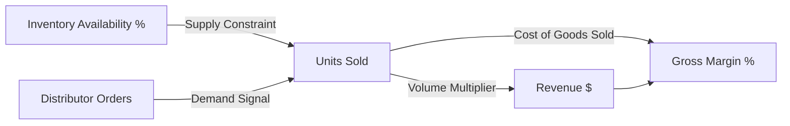

# InsightPilot AI — Round 2 Requirements & Project Contract

> **Accenture Innovation Challenge 2026 — Track 3: BusinessIntelligence.ai**  
> **Document Version:** 2.0.0  
> **Status:** Approved Baseline Contract  
> **Role:** Implementation Authority for Round 2 Development

---

## 1. Executive Summary & Problem Definition

### 1.1 Business Problem
Enterprise executives and regional operations managers face critical limitations in conventional business intelligence (BI) systems:
- **Descriptive-Only BI:** Traditional dashboards display *what* happened (e.g., revenue drops) but fail to explain *why* it happened or *how* to remediate it.
- **Siloed Enterprise Data:** Root causes span multiple disconnected silos (ERP financials, CRM pipelines, support tickets, and market intelligence). Correlating these manually takes days of analyst effort.
- **Black-Box AI Hallucinations:** Generative AI solutions often invent causal relationships and hallucinate quantitative metrics without lineage or mathematical verification.
- **Disconnected Execution:** Dashboards do not provide deterministic simulations of potential interventions or actionable recommendations tailored to specific executive personas.

### 1.2 The InsightPilot AI Solution
**InsightPilot AI** is an enterprise decision-intelligence platform that automates the complete analytical loop:
$$\text{Investigate} \longrightarrow \text{Explain} \longrightarrow \text{Recommend} \longrightarrow \text{Simulate}$$

It pairs **deterministic mathematical driver analysis and simulation** with **grounded LLM narrative synthesis**, anchored in an audited evidence graph with verifiable lineage.

---

## 2. Primary Investigation Scenario (Locked Baseline)

To ensure concrete evaluation, Round 2 locks the following primary enterprise scenario:

```
┌──────────────────────────────────────────────────────────────────────────┐
│ PRIMARY INVESTIGATION SCENARIO                                           │
│ Target KPI: North America East Revenue                                   │
│ Variance:   ↓ 8.0% ($14.2M actual vs $15.4M target / - $1.2M variance)   │
│ Period:     Q3 FY2026                                                    │
└──────────────────────────────────────────────────────────────────────────┘
```

The system autonomously investigates this variance, identifies and ranks its multi-factor drivers across enterprise data silos, cites verifiable evidence with timestamps and freshness metrics, generates persona-specific recommendations, and supports deterministic counterfactual what-if simulations.

---

## 3. Five Connected Core KPIs

InsightPilot AI evaluates five interconnected enterprise KPIs spanning financial, operational, and channel health:



| # | KPI Name | Domain | Business Definition | Target / Benchmark | Threshold Alert |
|---|---|---|---|---|---|
| **1** | **Revenue** | Financial (ERP) | Total net invoiced sales across all product lines and channels in the region. | $15.4M / Quarter | $\ge 5\%$ negative variance |
| **2** | **Gross Margin** | Financial (ERP) | Net revenue minus cost of goods sold (COGS) expressed as a percentage of revenue. | $42.5\%$ | $< 39.0\%$ |
| **3** | **Units Sold** | Operational (Sales/CRM) | Total physical volume of goods delivered and recognized across accounts. | $185,000$ units | $\ge 7\%$ negative variance |
| **4** | **Distributor Orders** | Channel (CRM) | Aggregate purchase orders placed by authorized wholesale distributor network. | $240$ POs / $142\text{k}$ units | $\ge 10\%$ volume drop |
| **5** | **Inventory Availability** | Operational (ERP) | Percentage of scheduled customer orders fulfillable immediately from regional distribution centers (DCs). | $\ge 95.0\%$ | $< 85.0\%$ |

---

## 4. Heterogeneous Enterprise Data Domains

The system ingests and correlates signals across three simulated enterprise data domains:

```
                  ┌────────────────────────────────────────┐
                  │          INSIGHTPILOT AI               │
                  │       Cross-Domain Ingestion           │
                  └──────────────────┬─────────────────────┘
                                     │
         ┌───────────────────────────┼───────────────────────────┐
         │                           │                           │
         ▼                           ▼                           ▼
┌───────────────────┐       ┌───────────────────┐       ┌───────────────────┐
│     DOMAIN 1      │       │     DOMAIN 2      │       │     DOMAIN 3      │
│  ERP & Financials │       │    CRM & Sales    │       │ Support & Market  │
├───────────────────┤       ├───────────────────┤       ├───────────────────┤
│ • Invoiced Sales  │       │ • Order Pipelines │       │ • Zendesk Tickets │
│ • Cost of Goods   │       │ • Account Tiering │       │ • Distributor Comms│
│ • Inventory DC Log│       │ • SKU Unit Volume │       │ • Competitor Scrap│
│ • Stockout Events │       │ • Order Delivery  │       │ • Market Reports  │
└───────────────────┘       └───────────────────┘       └───────────────────┘
```

1. **ERP (Enterprise Resource Planning & Supply Chain):**
   - Invoiced revenue, realized gross margins, product standard cost.
   - Distribution Center (DC) stock logs, stockout durations, transfer latency.
2. **CRM / Sales & Distribution:**
   - Distributor order volume, pipeline velocity, contract terms, fulfillment lag.
   - SKU-level sales breakdown, account cancellation notices, delivery confirmations.
3. **Customer Support & Market Intelligence:**
   - Zendesk/ServiceNow escalation tickets, distributor email threads, field complaint sentiment.
   - Competitive price tracking, competitor promotional intelligence, industry benchmark pricing.

---

## 5. Primary Multi-Factor Investigation Drivers

The analytical engine decomposes the North America East Revenue variance into **four distinct mathematical drivers**:

```
                              North America East Revenue ↓ 8.0% (-$1.20M)
                                                   │
        ┌──────────────────────────┬───────────────┴───────────────┬──────────────────────────┐
        ▼                          ▼                               ▼                          ▼
┌──────────────────────┐ ┌──────────────────────┐ ┌──────────────────────┐ ┌──────────────────────┐
│       DRIVER 1       │ │       DRIVER 2       │ │       DRIVER 3       │ │       DRIVER 4       │
│  Atlanta DC Stockout │ │ SKU-8821 Sales Vol.  │ │  Distributor Orders  │ │ Competitor Horizon   │
│                      │ │                      │ │                      │ │ Price ↓15%           │
├──────────────────────┤ ├──────────────────────┤ ├──────────────────────┤ ├──────────────────────┤
│ Contribution:  44.0% │ │ Contribution:  26.0% │ │ Contribution:  18.0% │ │ Contribution:  12.0% │
│ Impact:     -$528k   │ │ Impact:     -$312k   │ │ Impact:     -$216k   │ │ Impact:     -$144k   │
│ Confidence:    94%   │ │ Confidence:    89%   │ │ Confidence:    85%   │ │ Confidence:    78%   │
│ Domain: ERP Supply   │ │ Domain: CRM Sales    │ │ Domain: CRM Channel  │ │ Domain: Market Intel │
└──────────────────────┘ └──────────────────────┘ └──────────────────────┘ └──────────────────────┘
```

1. **Driver 1: Atlanta DC Stockout (ERP Supply Chain)**
   - *Description:* Severe stockout at the primary regional hub (Atlanta DC) caused fulfillment rate to plummet to 72% for 18 days.
   - *Impact:* $-\$528\text{k}$ ($44.0\%$ of total variance).
2. **Driver 2: SKU-8821 Sales Volume Drop (CRM / Commercial)**
   - *Description:* Key high-margin product line (SKU-8821) dropped $31.4\%$ in units delivered due to stock unavailability and delayed reorders.
   - *Impact:* $-\$312\text{k}$ ($26.0\%$ of total variance).
3. **Driver 3: Distributor Orders Deferral (CRM Channel)**
   - *Description:* Tier-1 wholesale distributors deferred reorders pending delivery assurances and volume discount re-negotiation.
   - *Impact:* $-\$216\text{k}$ ($18.0\%$ of total variance).
4. **Driver 4: Competitor Horizon Foods Price Cut (Market Intelligence)**
   - *Description:* Direct competitor Horizon Foods instituted a $15\%$ aggressive price promotion in the Mid-Atlantic corridor, causing selective customer churn.
   - *Impact:* $-\$144\text{k}$ ($12.0\%$ of total variance).

---

## 6. KPI Semantic Contract Specification

Every KPI managed by InsightPilot AI must adhere to a strict semantic contract. No uncontracted or ad-hoc metrics are permitted.

```json
{
  "kpi_id": "KPI_NA_EAST_REV",
  "name": "North America East Revenue",
  "definition": "Gross billed revenue net of returns and allowances for NA-East region.",
  "calculation_method": "SUM(invoices.net_amount) FILTER (WHERE region = 'NA-East' AND status = 'POSTED')",
  "granularity": "Quarterly / Monthly",
  "threshold_rules": {
    "nominal_target": 15400000.0,
    "warning_threshold_pct": -3.0,
    "critical_threshold_pct": -5.0
  },
  "associated_drivers": [
    "DRV_ATLANTA_STOCKOUT",
    "DRV_SKU8821_VOLUME",
    "DRV_DIST_ORDERS",
    "DRV_HORIZON_PRICING"
  ],
  "primary_source": "ERP_SAP_S4HANA.FICO",
  "refresh_frequency": "HOURLY",
  "lineage_path": "ERP.Invoices -> ETL.CleanedSales -> DataMart.RegionalFinancials",
  "access_restrictions": ["CFO", "REGIONAL_SALES_MANAGER"]
}
```

---

## 7. Evidence & Lineage Architecture

All conclusions, driver attributions, and recommendations must be directly traceable to verifiable enterprise evidence records.

### 7.1 Evidence Data Schema
Every evidence item comprises:
- `evidence_id`: Unique persistent identifier.
- `source_system`: Originating system (`SAP_ERP`, `ZENDESK_SUPPORT`, `DISTRIBUTOR_PORTAL`, `MARKET_SCRAPER`).
- `record_timestamp`: Time of event occurrence.
- `ingestion_timestamp`: Time of ingestion into InsightPilot.
- `freshness_indicator`: Time delta ($\Delta t = t_{\text{current}} - t_{\text{record}}$) classified as *Live*, *Recent*, or *Stale*.
- `analytical_methodology`: Quantitative algorithm or extraction rule applied (`Variance Decomposition`, `NLP Sentiment Extraction`, `Price Scraping & Regex Normalization`).
- `assigned_driver_id`: Target driver identifier.
- `contribution_weight`: Quantified contribution percentage ($w_i$).
- `confidence_score`: Mathematical confidence metric ($0.0 - 1.0$).
- `lineage_audit_url`: Deep link or database pointer to source record.

---

## 8. Confidence, Uncertainty & Low-Confidence Abstention

InsightPilot AI explicitly rejects "black-box guesswork." The system incorporates explicit confidence calculations and strict abstention policies.

### 8.1 Confidence Scoring Formula
$$\text{Confidence} = f(\text{Data Completeness}, \text{Signal Strength}, \text{Lineage Verification}, \text{Historical Sample Size})$$

### 8.2 Low-Confidence Abstention State
When available evidence is ambiguous, contradictory, or statistically insufficient, InsightPilot AI **abstains from asserting a false primary driver**.

```
┌──────────────────────────────────────────────────────────────────────────┐
│ LOW CONFIDENCE / ABSTENTION STATE                                        │
│ Target KPI: Product Line Beta Revenue ↓ 4.2%                             │
│ Potential Drivers:                                                       │
│   • Inventory Stockout: 38% contribution                                 │
│   • Price Elasticity:   34% contribution                                 │
│   • Regional Orders:    31% contribution                                 │
│ Aggregate Confidence Score: 41% (LOW — Threshold < 65%)                  │
│                                                                          │
│ SYSTEM OUTPUT:                                                           │
│ "No reliable primary driver identified. Multiple ambiguous factors       │
│ detected with insufficient variance separation. Additional operational   │
│ telemetry required before asserting causal attribution."                │
└──────────────────────────────────────────────────────────────────────────┘
```

---

## 9. Sparse-History Handling

The system must handle cold-start and sparse-history data regimes gracefully without fabricating causal histories.

### 9.1 Sparse-History Policy
- **Minimum Data Requirement:** At least 60 days / 2 fiscal quarters of baseline time series required for seasonal attribution.
- **Trigger Scenario:**
  - KPI: *GenAI Copilot Feature Adoption*
  - Available History: $14$ days
- **System Output:**
  `"Insufficient historical baseline (14 days available vs 60 days required). Time-series decomposition and seasonal attribution suspended. Displaying raw telemetry trend only."`

---

## 10. Multi-Persona Support & Role-Based Access Control (RBAC)

InsightPilot AI supports two distinct enterprise personas. The **underlying analytical truth and quantitative metrics remain 100% identical**, while narrative emphasis, UI focus, and action scopes adapt dynamically.

```
                                  ┌─────────────────────────────────┐
                                  │      UNIFIED ANALYTICAL TRUTH   │
                                  │  (Deterministic Engine Output)  │
                                  └───────────────┬─────────────────┘
                                                  │
                 ┌────────────────────────────────┴────────────────────────────────┐
                 ▼                                                                 ▼
┌─────────────────────────────────────────┐       ┌─────────────────────────────────────────┐
│              PERSONA: CFO               │       │     PERSONA: REGIONAL SALES MANAGER     │
├─────────────────────────────────────────┤       ├─────────────────────────────────────────┤
│ Scope: Financial & Portfolio Impact     │       │ Scope: Operational & Account Execution  │
│ Focus:                                  │       │ Focus:                                  │
│ • Net Revenue ($14.2M / -$1.2M)         │       │ • Inventory Availability (72% at ATL)   │
│ • Gross Margin Compression (38.8%)      │       │ • SKU-8821 Order Backlog (14,200 units) │
│ • Total Value-at-Risk ($2.4M annualized)│       │ • Distributor Fulfillment Lag (8.4 days)│
│ • Strategic Capital Reallocation        │       │ • Account Recovery & Expedited Freight  │
│ RBAC Access: Full Financial & C-Suite   │       │ RBAC Access: Regional Ops & CRM Lines   │
└─────────────────────────────────────────┘       └─────────────────────────────────────────┘
```

### 10.1 Persona Access Matrix

| Feature / Metric | CFO Persona | Regional Sales Manager Persona |
|---|---|---|
| **Enterprise Portfolio Financials** | Full Access | Masked / Read-Only Top Level |
| **Gross Margin & COGS Breakdown** | Full Access | Restricted |
| **Regional Supply Chain & DC Stock** | High-Level Summary | Deep-Dive Operational Telemetry |
| **Account / Distributor Level Details** | Summary Overview | Deep-Dive PO & Order Level |
| **Action Plan Scope** | Capex/Opex Approval, Vendor SLA Renegotiation | Inter-DC Stock Transfers, Account Discount Override |

---

## 11. Actionable Recommendations Framework

Recommendations must form an unbroken causal chain from root driver to expected financial outcome:

$$\text{Driver} \longrightarrow \text{Controllable Lever} \longrightarrow \text{Action Initiative} \longrightarrow \text{Expected Impact} \longrightarrow \text{Owner} \longrightarrow \text{Confidence}$$

```
┌──────────────────────────────────────────────────────────────────────────┐
│ STRATEGIC INTERVENTION CARD 1                                            │
│ • Driver:             Atlanta DC Stockout (44% contribution)             │
│ • Controllable Lever: Supply Chain Re-routing & Inter-DC Transfer        │
│ • Action:             Initiate emergency transfer of 18,500 units from   │
│                       Charlotte DC to Atlanta Hub.                       │
│ • Expected Impact:    +$410,000 revenue recovery in 14 days;             │
│                       restores inventory availability to 92.5%.          │
│ • Owner:              VP Supply Chain Logistics                          │
│ • Confidence:         92%                                                │
├──────────────────────────────────────────────────────────────────────────┤
│ STRATEGIC INTERVENTION CARD 2                                            │
│ • Driver:             Competitor Horizon 15% Price Cut (12% contribution)│
│ • Controllable Lever: Tactical Channel Rebate                            │
│ • Action:             Authorize temporary 5% volume rebate for Tier-1    │
│                       distributors on 90-day purchase commitments.       │
│ • Expected Impact:    +$180,000 revenue protection; halts churn.         │
│ • Owner:              Commercial Director East                           │
│ • Confidence:         84%                                                │
└──────────────────────────────────────────────────────────────────────────┘
```

---

## 12. Deterministic What-If Simulation Engine

InsightPilot AI provides a mathematical what-if simulation tool enabling decision-makers to evaluate parameter changes before committing capital.

### 12.1 Simulation Principles
- **Deterministic Math:** Simulation formulas are executed via deterministic Python/Rust algorithms (elasticity curves, inventory transfer models).
- **LLM Boundary:** The LLM *never* generates simulation numbers. It solely generates executive narrative interpretations of the calculated scenarios.

### 12.2 Primary Simulation Scenario
- **Input Slider:** Inventory Availability ($72\% \longrightarrow 95\%$)
- **Simulation Formula:**
  $$\Delta \text{Revenue} = \Delta \text{Availability} \times \text{Unmet Demand Volume} \times \text{Average Selling Price} \times (1 - \text{Substitution Rate})$$
- **Projected Output:**
  - Availability at $90\% \implies +\$385\text{k}$ Revenue Recovery / $+1.4\%$ Margin Recovery.
  - Availability at $95\% \implies +\$510\text{k}$ Revenue Recovery / $+2.1\%$ Margin Recovery.

---

## 13. LLM vs. Non-LLM Architectural Boundaries

To guarantee 100% auditability and prevent hallucinations, InsightPilot AI strictly separates deterministic calculation from generative narrative synthesis.

```
┌──────────────────────────────────────────────────────────────────────────┐
│                   DETERMINISTIC / NON-LLM RESPONSIBILITIES               │
│ • KPI metric calculations & variance formulas (SQL / Pandas / NumPy)     │
│ • Mathematical driver decomposition & contribution percentages           │
│ • Confidence scoring algorithms & threshold evaluations                  │
│ • Data freshness, timestamp calculations, and lineage pointers           │
│ • What-if simulation mathematical equations                              │
│ • Role-Based Access Control (RBAC) filtering & security enforcement      │
│ • Abstention trigger evaluations                                         │
└────────────────────────────────────┬─────────────────────────────────────┘
                                     │ Grounded Structured Context
                                     ▼
┌──────────────────────────────────────────────────────────────────────────┐
│                       LLM / GENERATIVE RESPONSIBILITIES                  │
│ • Natural language narrative generation grounded strictly in data        │
│ • Persona-tailored phrasing (CFO financial tone vs RSM operational tone) │
│ • Synthesis of multi-source evidence into executive summaries            │
│ • Clear explanation of deterministic simulation outputs                  │
│ • Boardroom-ready Executive Briefing document drafting                   │
└──────────────────────────────────────────────────────────────────────────┘
```

---

## 14. Runtime Telemetry Specification

The application will expose real-time operational telemetry through a dedicated diagnostic inspector:

- **End-to-End Latency:** Breakdown of data query time, analytical decomposition time, and LLM inference time.
- **LLM Observability:** Model identifier (`gemini-2.5-flash` / `gemini-1.5-pro`), input token count, output token count, estimated invocation cost.
- **Data Source Audit:** List of database tables queried, cache hit rate, and execution timestamps.
- **Evidence Verification:** Total evidence nodes retrieved, validated citations, and filtered outliers.

---

## 15. Mapping to Existing 7 Stitch UI Screens

The Round 1 Stitch designs serve as the **visual source of truth**. Round 2 requirements map directly onto these established screens:

```
┌─────────────────────────────────────────────────────────────────────────────────────────────────┐
│ STITCH UI SCREEN MAPPING                                                                        │
├───────────────────────────────────────────────────────┬─────────────────────────────────────────┤
│ Stitch Screen (Visual Source of Truth)                │ Round 2 Functional Responsibility       │
├───────────────────────────────────────────────────────┼─────────────────────────────────────────┤
│ 1. Executive Command Center v3                        │ • Enterprise portfolio KPI health       │
│    (executive_command_center_v3_optimized_hierarchy)  │ • Variance alerts & thresholds          │
│                                                       │ • Persona switcher (CFO vs RSM entry)   │
├───────────────────────────────────────────────────────┼─────────────────────────────────────────┤
│ 2. AI Investigation Activity v2                       │ • Real-time investigation timeline      │
│    (ai_investigation_activity_v2)                     │ • Telemetry drawer / status stream      │
│                                                       │ • Diagnostic steps & source queries     │
├───────────────────────────────────────────────────────┼─────────────────────────────────────────┤
│ 3. Root Cause Investigation v2                        │ • Multi-factor driver ranking           │
│    (root_cause_investigation_v2)                      │ • Mathematical contribution cards (%)   │
│                                                       │ • Confidence badges & abstention states │
├───────────────────────────────────────────────────────┼─────────────────────────────────────────┤
│ 4. Decision Graph v4                                  │ • Graph visualization linking KPI       │
│    (decision_graph_v4_final_presentation_view)        │   to drivers, evidence & external events│
├───────────────────────────────────────────────────────┼─────────────────────────────────────────┤
│ 5. Evidence Explorer v2                               │ • Lineage inspection & source citations │
│    (evidence_explorer_v2)                             │ • Freshness timestamps & audit links    │
│                                                       │ • Cross-domain signal validation        │
├───────────────────────────────────────────────────────┼─────────────────────────────────────────┤
│ 6. Recommendations & Simulation v3                    │ • Driver -> Action -> Owner matrix      │
│    (recommendations_simulation_v3_decision_ready)     │ • Interactive what-if parameter sliders │
│                                                       │ • Deterministic outcome projections     │
├───────────────────────────────────────────────────────┼─────────────────────────────────────────┤
│ 7. Executive Briefing v3                              │ • Automated boardroom-ready synthesis   │
│    (executive_briefing_v3_boardroom_ready)            │ • Situation / Diagnosis / Next Steps    │
│                                                       │ • Exportable briefing packet            │
└───────────────────────────────────────────────────────┴─────────────────────────────────────────┘
```

> **Design Constraint:** No existing Stitch screen will be redesigned, deleted, or replaced. Round 2 extensions (e.g., telemetry drawers, confidence warnings, abstention notices, semantic contract modals) will be integrated directly into the established visual hierarchy.

---

## 16. Round 2 Definition of Done (Checklist)

Before final submission for the Accenture Innovation Challenge 2026, the implementation must satisfy all items below:

- [ ] **Connected KPIs:** Implementation of 5 connected KPIs (Revenue, Gross Margin, Units Sold, Distributor Orders, Inventory Availability).
- [ ] **Heterogeneous Data Domains:** Ingestion of 3 enterprise domains (ERP Financials, CRM Sales, Support & Market Intelligence).
- [ ] **KPI Semantic Contracts:** Formal contracts defining calculations, thresholds, drivers, and lineages for all core KPIs.
- [ ] **Multi-Factor Investigation:** Automated decomposition of NA-East Revenue $\downarrow 8\%$ into 4 quantified drivers.
- [ ] **Contribution Ranking:** Deterministic contribution percentages ($44\%$, $26\%$, $18\%$, $12\%$).
- [ ] **Evidence & Lineage:** Traceable evidence cards with source attribution, timestamps, and freshness metrics.
- [ ] **Confidence Scoring:** Explicit confidence scoring across drivers and conclusions.
- [ ] **Low-Confidence Abstention:** Graceful abstention when signal is ambiguous (e.g., $41\%$ confidence scenario).
- [ ] **Sparse-History Handling:** Graceful fallback and notice when time series is $<60$ days.
- [ ] **Two Personas:** Distinct experiences and narrative focus for CFO and Regional Sales Manager.
- [ ] **Role-Based Access Control (RBAC):** Persona-scoped data visibility and action gating.
- [ ] **Actionable Recommendations:** Structured intervention cards with levers, owners, and impacts.
- [ ] **Deterministic What-If Simulation:** Interactive parameter sliders recalculating business recovery without LLM hallucinations.
- [ ] **LLM / Non-LLM Separation:** Complete decoupling of math calculations from narrative generation.
- [ ] **Runtime Telemetry:** Inspector panel exposing latency, token usage, cost, and database access logs.
- [ ] **Seven Stitch Screens Integrated:** Full integration and state binding with all 7 Round 1 Stitch screens.
- [ ] **End-to-End Working Prototype:** Fully functional, interactive web application running locally and verifiable.
- [ ] **Public GitHub Repository:** Clean, structured repository on `https://github.com/ayus1234/InsighPilotAI`.
- [ ] **Documentation & Presentation:** Comprehensive README, architecture docs, demo video script, and pitch deck.
