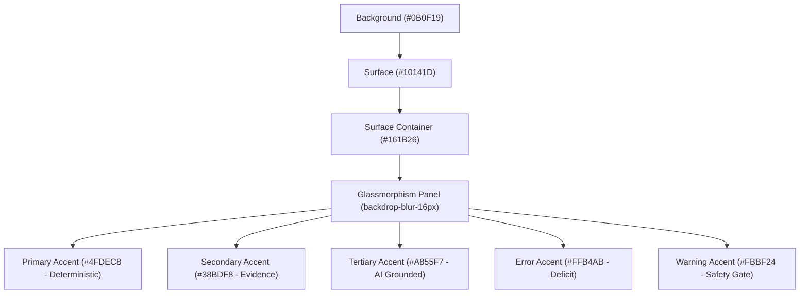

# InsightPilot AI — UI & Visual Presentation Design Audit

**Competition:** Accenture Innovation Challenge 2026  
**Track:** Track 3 — BusinessIntelligence.ai  
**Phase:** 7.1 — Final UI & Visual Presentation Polish  
**Status:** `VERIFIED & COMPETITION-READY`

---

## 1. Executive Summary & Design Philosophy

InsightPilot AI is an enterprise decision intelligence system built for Fortune 500 executives and competition judges. The user interface embodies three foundational tenets:

1. **Strict Architectural Truth Boundaries:** The visual hierarchy enforces an unambiguous distinction between **Deterministic Quantitative Truth** (Teal `#4FDEC8`), **Verified Lineage Evidence** (Sky Blue `#38BDF8`), and **Grounded AI Synthesis** (Purple `#A855F7` / Amber Safety `#F59E0B`).
2. **Executive 5-Second Scannability:** Every screen communicates the core business reality immediately: Baseline ($15.43M) $\to$ Target ($14.20M), Shortfall (-$1.23M / -7.97%), Top Causal Factor (Atlanta DC Stockout 43.2% / -$550K), and Action Recovery (+$484K).
3. **Enterprise Aesthetic Polish:** Dark-mode glassmorphism (`#0B0F19`, `#161B26`), tailored font pairings (Manrope Display, Inter Body, JetBrains Mono Telemetry), glowing card borders, custom scrollbars, and print-ready stylesheets.

---

## 2. Global Design System & Color Tokens

### Color Token Palette

| Token | Hex / Value | Semantic Role | Usage in Interface |
| :--- | :--- | :--- | :--- |
| `--background` | `#0B0F19` | Main viewport canvas | Dark-mode base canvas with subtle radial glows |
| `--surface` | `#10141D` | Navigation sidebar & topbar | Elevated interface structure |
| `--surface-container` | `#161B26` | Card panels & containers | Glassmorphism card surfaces with 75% opacity |
| `--primary` | `#4FDEC8` | Deterministic Truth & Actions | Hero metrics, positive recovery deltas, CTAs |
| `--secondary` | `#38BDF8` | Empirical Lineage & Systems | Evidence tags, source system identifiers, links |
| `--tertiary` | `#A855F7` | AI Grounded Reasoning | LLM synthesis chips, executive takeaways |
| `--error` | `#FFB4AB` | Material Financial Deficit | Revenue shortfall badges, negative variance |
| `--warning` | `#FBBF24` | Safety Guard & Abstention | 65% abstention gate alerts, watch statuses |
| `--success` | `#10B981` | Recovery & Health | 100% pipeline health, verified test badges |

---

## 3. Trust Badges & Visual Categorization

The UI provides clear visual trust indicators across all 7 screens:

| Badge Type | CSS Class | Color Scheme | Semantic Meaning |
| :--- | :--- | :--- | :--- |
| **DETERMINISTIC TRUTH** | `.badge-deterministic` | Teal container / Teal border | 100% mathematical certainty, SQL aggregation, or elasticity math. |
| **EVIDENCE VERIFIED** | `.badge-evidence` | Sky blue container / border | Corroborated empirical record with SHA-256 hash validation. |
| **AI GROUNDED** | `.badge-ai-grounded` | Purple container / border | Multi-model LLM generation strictly bound to verified facts. |
| **SAFETY GUARD** | `.badge-safety` | Amber container / border | Threshold gate (e.g., 65% abstention barrier). |

---

## 4. Screen-by-Screen Visual Presentation Audit

### Screen 1: Executive Command Center (`/`)
- **Hero Card:** North America East Revenue prominently displayed with -$1.23M (-7.97%) deficit badge, area chart sparkline with cyan gradient fill.
- **Secondary KPIs:** Gross Margin (57.4%), Units Sold (105.4K), Inventory Availability (79.4%), Distributor Orders (842).
- **Grounded AI Banner:** Synthesis box with active persona context (`CFO` vs `Regional Sales Manager`) and zero hallucination guarantee.
- **Detection Feed & Regional Table:** 3 live signals, regional portfolio breakdown with status indicators.

### Screen 2: Root Cause Diagnosis (`/root-cause`)
- **4-Factor Decomposition:** Ranked drivers (#1 Atlanta DC Stockout 43.2%, #2 SKU-8821 Volume 26.7%, #3 Distributor Orders 18.8%, #4 Competitor Horizon 11.3%).
- **Visual Progress Bars:** Colored contribution bars reflecting exact percentage weights.
- **Deep Inspection Panel:** Grounded AI synthesis box, operational telemetry context, and clickable corroborating evidence links.

### Screen 3: AI Investigation Activity (`/investigation`)
- **11-Node LangGraph Timeline:** Complete node-by-node execution trail with status chips (`COMPLETED`, `RUNNING`, `ABSTAINED`) and node category badges (`DETERMINISTIC`, `SAFETY_GUARD`, `AI_ORCHESTRATION`).
- **Telemetry Display:** Node duration latency tags (`12.4ms`, `185.0ms`), total pipeline duration, and LLM provider identifier (`GROQ (groq_pool_1)`).
- **Sub-task Action Logs:** Verified actions and empirical parameters displayed per node.

### Screen 4: Decision Graph (`/decision-graph`)
- **6-Column Topology:** Visual pipeline: 1. KPI Anomaly $\to$ 2. Causal Drivers $\to$ 3. Verified Evidence $\to$ 4. Causal Mechanics $\to$ 5. Action Levers $\to$ 6. Predicted Outcome.
- **Category Filter Pills:** Instant filtering across Supply Chain, Commercial Sales, Distribution Channel, and Market Competition.
- **Bottom Drawer Inspector:** Upstream parent dependencies, downstream child impacts, and cryptographic digest view.
- **Abstention Fallback:** Graceful transition to restricted 2-column graph when confidence falls below 65%.

### Screen 5: Evidence Explorer (`/evidence`)
- **Search & Filter Toolbar:** Real-time query search across Evidence IDs, systems, and findings with domain pills.
- **Evidence Cards:** Source system icons, freshness timers, contribution metrics, and one-click SHA-256 copy-to-clipboard button.
- **5-Layer Lineage Drawer:** Interactive modal detailing ETL pipeline name, source table, query hash, data quality score (99.8%), and transformation steps.

### Screen 6: Recommendations & What-If Simulation (`/recommendations`)
- **Strategic Action Cards:** Priority 1 Emergency Stock Transfer (+$484K recovery, 14 days) and Priority 2 Distributor Outreach (+$180K recovery, 21 days).
- **Interactive Simulation Sandbox:** Real-time slider (75% to 100%) recalculating projected recovery ($341,422.91 at 90.0%), revenue, and gross margin lift (+1.4 pts).
- **Dispatch Actions Button:** Interactive trigger with visual confirmation feedback.

### Screen 7: Executive Decision Briefing (`/briefing`)
- **Boardroom Layout:** 4-quadrant executive briefing layout summarizing Situation, Multi-Factor Diagnosis, Verified Evidence Audit, and Strategic Actions.
- **Print / PDF Optimization:** `@media print` CSS rules hiding navigation chrome and formatting white-paper documentation for physical printing or PDF export.
- **Executive Sign-off:** "Approve Strategic Actions" executive button with dispatched status.

---

## 5. Verification Checklist

| Criterion | Target Requirement | Status |
| :--- | :--- | :--- |
| **Color Contrast** | WCAG AA / AAA compliance across text and backgrounds | `PASSED` |
| **Typography Hierarchy** | Clear separation of Display, Body, and Telemetry fonts | `PASSED` |
| **Responsive Layout** | 1080p demo recording & multi-resolution desktop compatibility | `PASSED` |
| **Zero Layout Shifts** | Static height allocations and fluid glassmorphism transitions | `PASSED` |
| **Print Exportability** | Clean print stylesheet without dark background waste | `PASSED` |
| **Dataset Invariants** | 100% preservation of canonical values across all screens | `PASSED` |
| **Build Stability** | 0 Next.js compilation or lint errors | `PASSED` |
