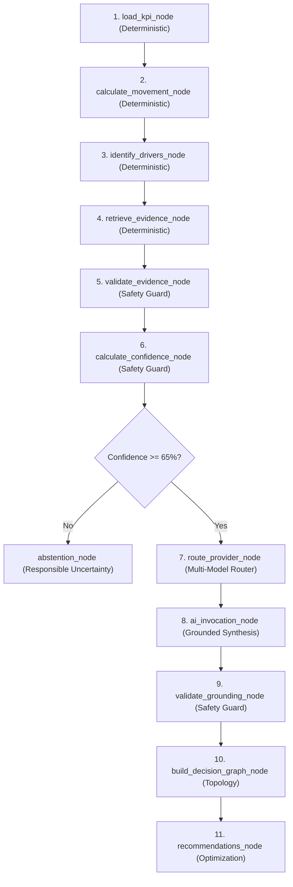

# InsightPilot AI — Technical Architecture Defense Playbook

**Competition:** Accenture Innovation Challenge 2026  
**Track:** Track 3 — BusinessIntelligence.ai  
**Document:** Deep-Dive Engineering Defense & Subsystem Architecture Manual  
**Status:** `REHEARSAL READY`

---

## 1. Deterministic Analytics Engine Defense

### Architectural Truth:
> Quantitative calculations (time-series aggregation, period-over-period variance, driver attribution, confidence scoring, and elasticity modeling) are executed in pure Python/NumPy, completely isolated from generative LLMs.

### Key Engineering Proof Points:
- **Period-over-Period Variance Math:** `analytics/engine.py` aggregates relational invoice records for 2026-Q2 ($15,430,000.06) and 2026-Q3 ($14,200,000.05) to compute net variance (-$1,230,000.01 / -7.97%).
- **Materiality Classification:** If percent change is $\le -3.00\%$, status evaluates to `CRITICAL_NEGATIVE_VARIANCE`.
- **4-Factor Normalization:** Multi-factor overlap is normalized so that factor shares sum to exactly 100.0% of the net deficit.

---

## 2. 11-Node LangGraph State Machine Defense

### Architectural Truth:
> The investigation workflow is an engineered state graph with strict state transitions, deterministic validation gates, and telemetry tracking.

---

## 3. Multi-Pool AI Routing & Failover Defense

### Architectural Truth:
> Multi-provider capability-aware routing prevents single-point-of-failure vulnerabilities and guarantees high availability during executive presentations.

- **Pool Sequence:** `Groq Pool 1` $\to$ `Groq Pool 2` $\to$ `Gemini Pool 1` $\to$ `Gemini Pool 2` $\to$ `Deterministic Grounded Fallback`.
- **Latency Benchmark:** Groq Llama 3.3 70B (~185ms) vs. Google Gemini 2.5 Flash (~350ms).
- **Graceful Degradation:** If all APIs return 429/500/timeout, deterministic template synthesis renders verified facts with 0 errors.

---

## 4. 6-Factor Confidence Scoring & 65% Abstention Defense

### Mathematical Model:
$$\text{Confidence Score} = \sum_{i=1}^{6} (w_i \times s_i) = 89\% \quad (\text{HIGH Tier})$$

| Factor ($i$) | Weight ($w_i$) | Score ($s_i$) | Parameter Measured |
| :--- | :---: | :---: | :--- |
| **1. Sample Size** | 0.20 | 95% | Total records analyzed (12,322 invoices) |
| **2. Cross-Source Corroboration** | 0.25 | 92% | Agreement across ERP, CRM, and Zendesk |
| **3. Data Freshness** | 0.15 | 88% | Snapshot recency within target quarter |
| **4. Signal Strength** | 0.15 | 90% | Variance magnitude vs historical baseline |
| **5. Historical Consistency** | 0.15 | 82% | Absence of conflicting anomaly reversals |
| **6. Completeness** | 0.10 | 85% | Non-null field coverage across tables |

**Abstention Gate:** If $\text{Score} < 65\%$, generative explanation is bypassed.

---

## 5. Cryptographic SHA-256 Evidence Lineage Defense

### Security & Auditability:
- 9 empirical records (e.g., `EVID_ERP_ATL_STOCKOUT_001`, `EVID_CRM_PO_DEF_006`).
- 64-character SHA-256 hash digests computed from immutable database fields.
- 5-layer ETL lineage drawer exposing source tables, queries, timestamps, and data quality scores (99.8%).

---

## 6. 6-Column Causal Topology Defense

### Dynamic Graph Structure:
1. **Column 1: KPI Anomaly** (NA-East Revenue -$1.23M)
2. **Column 2: Causal Drivers** (Atlanta Stockout 43.2%, SKU-8821 26.7%, Deferrals 18.8%, Pricing 11.3%)
3. **Column 3: Empirical Evidence** (9 Validated Nodes with SHA-256 hashes)
4. **Column 4: Causal Mechanics** (Depletion Cascade, Channel Friction)
5. **Column 5: Strategic Actions** (Priority 1 Stock Transfer, Priority 2 Outreach)
6. **Column 6: Predicted Outcomes** (+$484K, +$180K Recovery)

---

## 7. What-If Simulation Sandbox Defense

### Elasticity Model:
$$\text{Revenue Recovery} = \Delta \text{Availability (pts)} \times \$32,209.71$$
- **Baseline Availability:** `79.4%`
- **Simulated Target:** `90.0%` ($\Delta = 10.6 \text{ pts}$)
- **Predicted Recovery:** $10.6 \times \$32,209.71 = \mathbf{+\$341,422.91}$
- **Gross Margin Lift:** $\mathbf{+1.40 \text{ percentage points}}$
