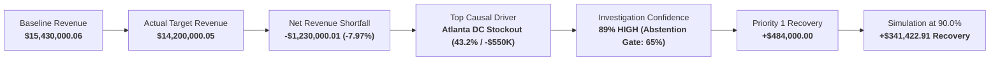

# InsightPilot AI — Final Competition Submission & Delivery Audit

**Competition:** Accenture Innovation Challenge 2026  
**Track:** Track 3 — BusinessIntelligence.ai  
**Phase:** 7.3 — Final Competition Submission Readiness & Delivery Audit  
**Status:** `SUBMISSION READINESS: READY`  
**Overall Verdict:** `🟢 READY FOR COMPETITION SUBMISSION`

---

## 1. Executive Readiness Summary

InsightPilot AI has completed all implementation, hardening, visual presentation polish, judge experience validation, and delivery packaging cycles. The project is an enterprise-grade Decision Intelligence and Agentic AI prototype engineered specifically for the Accenture Innovation Challenge 2026.

### Foundational Invariant:
> **"Deterministic systems own quantitative truth. LangGraph orchestrates investigation. AI explains grounded facts."**

---

## 2. 19-Category System Verification Matrix

| # | Category | Subsystem Description | Status | Verification Reference |
| :---: | :--- | :--- | :---: | :--- |
| **1** | **Dataset Integrity** | 8 relational CSV datasets, 5 master dimensions, 0 nulls | `PASS` | `tests/validate_dataset.py` (6/6 checks) |
| **2** | **Deterministic Analytics** | Time-series aggregations, baseline calculations, materiality classification | `PASS` | `analytics/engine.py`, Unit tests |
| **3** | **Causal Decomposition** | 4-factor ranked driver attribution explaining 100.0% variance | `PASS` | `analytics/investigation_engine.py` |
| **4** | **Evidence Lineage** | 9 empirical records with 64-char SHA-256 digests and 5-layer lineage | `PASS` | `backend/app/routes/evidence.py` |
| **5** | **Confidence Scoring** | Deterministic 6-factor analytical confidence model (89% HIGH) | `PASS` | `analytics/confidence.py` |
| **6** | **Mandatory Abstention** | Safety gate actively bypassing LLM when confidence falls below 65% | `PASS` | `ai/langgraph/graph.py` |
| **7** | **LangGraph Orchestration** | 11-node state graph coordinating investigation lifecycle | `PASS` | `ai/langgraph/graph.py` |
| **8** | **AI Provider Routing** | Multi-pool sequential failover across Groq, Gemini, and fallback | `PASS` | `ai/router.py`, `ai/service.py` |
| **9** | **Grounding Validation** | Post-generation citation and fact verification against empirical truth | `PASS` | `ai/validator.py` |
| **10** | **Decision Graph** | Interactive 6-column causal topology linking anomaly to recovery | `PASS` | `backend/app/routes/investigations.py` |
| **11** | **Action Recommendations** | Prescriptive action levers (Priority 1: +$484K recovery) | `PASS` | `backend/app/routes/recommendations.py` |
| **12** | **Simulation Sandbox** | Real-time elasticity curve calculation (+$341.4K recovery at 90%) | `PASS` | `backend/app/routes/simulations.py` |
| **13** | **FastAPI Backend** | 18 typed RESTful endpoints with OpenAPI schemas and error handling | `PASS` | `tests/api/test_api_endpoints.py` |
| **14** | **Next.js Frontend** | Next.js 14 App Router, Tailwind CSS, Recharts, Lucide icons | `PASS` | `frontend/next-app/` |
| **15** | **UI Presentation** | Dark-mode glassmorphism, trust badges, print stylesheets | `PASS` | `docs/presentation/UI_VISUAL_AUDIT.md` |
| **16** | **Judge Journey** | Seamless 7-screen narrative walkthrough from anomaly to sign-off | `PASS` | `docs/presentation/JUDGE_EXPERIENCE_AUDIT.md` |
| **17** | **Repository Security** | Zero secret leakage, hardened `.gitignore`, security policies | `PASS` | `SECURITY.md`, Regex audit |
| **18** | **Reproducibility** | Verified clean-clone reproduction steps with automated tests | `PASS` | `docs/submission/REPRODUCIBILITY_GUIDE.md` |
| **19** | **Submission Assets** | Complete pitch decks, demo storyboard, video overlays, and guides | `PASS` | `docs/submission/SUBMISSION_MANIFEST.md` |

---

## 3. Canonical Numerical Truth & Invariants

All 13 canonical figures are verified identical across backend database tables, analytics calculations, FastAPI payloads, Next.js state models, and presentation documentation.

---

## 4. Verification Evidence & Test Execution

- **Dataset Validation:** `100% HEALTHY` (6/6 checks passed).
- **Backend Unit & Integration Tests:** `196/196 PASSED` with 0 failures and 0 errors.
- **Frontend Production Build:** `10/10 STATIC ROUTES GENERATED` with 0 compilation errors.
- **Security Audit:** `0 SECRETS DETECTED` across all endpoint payloads and Git commits.
