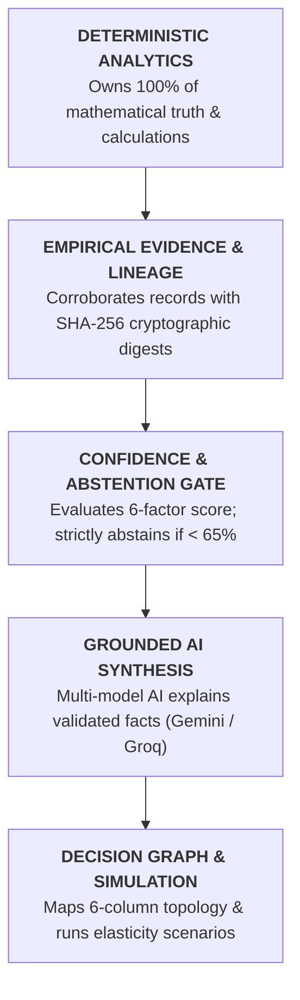

# InsightPilot AI — Judge Quickstart Guide (5-Minute Evaluation)

**Competition:** Accenture Innovation Challenge 2026  
**Track:** Track 3 — BusinessIntelligence.ai  
**Document:** Judge Quickstart & Evaluation Blueprint

---

## 1. What is InsightPilot AI?

### One Sentence:
> **InsightPilot AI is an enterprise decision intelligence system that transforms reactive business intelligence into autonomous, evidence-grounded root cause diagnosis, decision graphs, and prescriptive simulation.**

### One Paragraph:
Traditional Business Intelligence dashboards inform executives *what* happened, leaving the *why* to weeks of manual correlation. Generic LLMs attempt to answer *why*, but frequently hallucinate mathematical facts and lack verifiable auditability. **InsightPilot AI bridges this fundamental gap with a strict architectural boundary: deterministic analytics calculate mathematical truth, multi-agent LangGraph workflows retrieve empirical evidence with cryptographic SHA-256 lineage, and multi-model AI (Gemini & Groq) explains validated facts with zero hallucination risk.**

---

## 2. Architectural Truth Hierarchy

---

## 3. Recommended 5-Minute Judge Journey

Follow this sequence to evaluate the complete end-to-end prototype:

| Step | Screen / Route | Primary Judge Focus | Key Metric to Verify |
| :---: | :--- | :--- | :--- |
| **1** | **Command Center** [`/`](http://localhost:3000) | Hero KPI anomaly detection & executive AI banner | Revenue shortfall: **-$1,230,000.01 (-7.97%)** |
| **2** | **Root Cause Diagnosis** [`/root-cause`](http://localhost:3000/root-cause) | 4-factor ranked causal decomposition | Top Driver: **Atlanta DC Stockout (43.2% / -$550K)** |
| **3** | **Investigation Activity** [`/investigation`](http://localhost:3000/investigation) | 11-node LangGraph execution timeline & telemetry | Confidence: **89% HIGH** • Latency: **~185ms** |
| **4** | **Decision Graph** [`/decision-graph`](http://localhost:3000/decision-graph) | 6-column causal topology linking anomaly to recovery | **14 Nodes, 17 Edges** across 6 distinct layers |
| **5** | **Evidence Explorer** [`/evidence`](http://localhost:3000/evidence) | SHA-256 digests & 5-layer lineage audit drawer | **9 verified nodes** with SHA-256 cryptographic hashes |
| **6** | **Recommendations & Simulation** [`/recommendations`](http://localhost:3000/recommendations) | Action levers & interactive elasticity sandbox | Recovery: **+$484K** • Simulation: **+$341.4K at 90%** |
| **7** | **Executive Briefing** [`/briefing`](http://localhost:3000/briefing) | Boardroom-ready synthesis & action sign-off | Print-ready layout • **+$757.6K combined pool** |

---

## 4. Key Questions Answered for Judges

1. **How does InsightPilot AI prevent hallucinations?**  
   The LLM never calculates numbers. Quantitative figures are pre-calculated by deterministic Python engines and injected into strictly grounded prompts with automated post-generation citation validation.
2. **What happens if data is uncertain or conflicting?**  
   The deterministic 6-factor confidence model calculates an objective score. If confidence is below 65%, the **Mandatory Abstention Guard** safely bypasses generative explanation and provides transparent, responsible uncertainty.
3. **Can executives verify where the numbers came from?**  
   Yes. Every driver links directly to empirical evidence records possessing verified 64-character SHA-256 hash digests and complete 5-layer ETL lineage.
